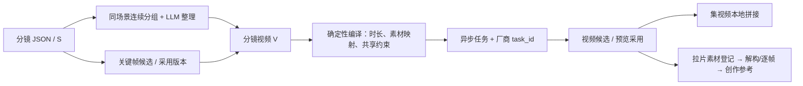

# 三层视频创作台：评估与落地设计

日期：2026-09-21。版本：v2（可编辑 S、独立 S 视频、尾帧关联、角色音色资产）。状态：设计评估稿；本文件与原型不是已上线功能。

配套：[三栏交互原型](prototypes/video-unit-studio.html)。使用示例数据，可切换 V/S、调整时长、预览参考方式；不保存项目、不发送生成请求。工作台运行时可打开 `http://127.0.0.1:8775/media?p=workbench/docs/prototypes/video-unit-studio.html`。

## 1. 要解决的问题

用户期望：关键帧是视频创作的锚点；2～3 秒的 S 不必分别向视频模型付费请求。应把连续、同场景的一组 S 整合为一个完整视频请求，再把选用的视频版本组合成集视频。创作页改为左中右三栏，保留原分镜提示词关联、资产 @ 引用、共享场景和负面词、可编辑总时长。

定义统一如下，技术字段避免与原有 `transition`（硬切、叠化等转场方式）混用：

| 产品名称 | 示例 | 数据职责 | 是否直接请求视频模型 |
|---|---|---|---|
| 转场镜头 S | E1/S1 | 最小叙事和机位单位，保存可编辑的动作、台词、景别、提示词；生成和选用关键帧 | 支持直接生成“转场镜头视频”，不要求先创建 V |
| 分镜视频 | E1/V01，包含 S1～S3 | 一个连续场景内的创作单元：有序 S、组合提示词、共享约束、时长、参考图方案 | 一次请求、一个完整视频 |
| 集视频 | E1 | 按编辑顺序组合多个分镜视频的已选版本，并管理声音轨 | 本地合成任务，默认不再次请求生成模型 |

编号以项目 + 分镜文件 + 对象 ID 为完整身份。不同集的 S1/V01 不能互相覆盖。V01 是显示序号，内部使用不随排序变化的稳定 ID。

### 名称与输出文件统一

- S 始终称“转场镜头”，S 的视频产物称“转场镜头视频”；V 始终称“分镜视频”。禁止把 V 写成“场景”，或把 S/V 的视频候选放进同一个无范围列表。
- 显示层示例：`E1 / S03 · 转场镜头视频`、`E1 / V02 · 分镜视频（S04–S06）`、`E1 · 集视频`。旧数据里的 S3 等 ID 不重命名，仅显示层补零。
- 建议文件名：`08_E01_S003_VIDEO_v001_<item短ID>.mp4`、`08_E01_V002_VIDEO_v001_<item短ID>.mp4`、`08_E01_EPISODE_v001_<item短ID>.mp4`；关键帧为 `08_E01_S003_KF_MAIN_v001_<item短ID>.png`。用途大写、版本小写，避免 V 与 v 混淆。前缀遵循现有项目命名规则；文件名用于辨认，身份以 manifest 的稳定 ID 为准。
- 生成范围与媒体类型正交：`scope_type=shot|video_unit`，`media_type=image|video`。点击 S 不切换媒体类型；S+video 直接出单 S 视频，S+image 生成该 S 的关键帧。V+image 显示“选择要生成关键帧的 S”或逐 S 生成入口，不自动把一个 V 生成成一张拼图。
- 单独 S 视频有自己的时长覆盖和采用版本，不修改 V 的规划、已有 V 视频或原 S.dur。模型最低时长仍预检：例如 S 原为 3 秒、模型最低 4 秒时，提示用户明确设置 4 秒或换模型，不静默延长。

## 2. 现有实现核查

1. `CreateView.vue` 的 `shotGroups` 按 `scene_name/scene/location` 放进 Map；常见值仅 `room/field`，既可能把不同地点合并，又可能把不连续的同场景片段拉到一起。这只是显示分组，不能当视频创作分组。
2. `create_batch.py` 按 `shots` 循环，每个 S 创建一条视频请求。没有视频单元的集合概念。
3. `prompt_assembler.resolve_shot_refs` 主要查资产母图、状态图和显式路径；没有把用户在画廊选用的关键帧版本作为默认视频输入。
4. `create_media.py` 的视频分支仍只传 prompt、image_refs 和 out_path。现有 `--ref-role/--ref-time` 未完整消费；前端没有把总时长传到这里，现有模型快照也未传给视频调用。
5. Ark 分支将所有图片包装成普通 image_url，没有按 keyframe/first_frame/last_frame 分类编译。负面词需要依模型协议写入支持的字段或正文，当前视频链路也需补齐。
6. `storyboard_panels.py` 已有 panels/grids 的数据校验和宫格定义，可复用部分身份、版本指纹逻辑，但目前的 3x3/5x5 宫格列表不是已完成的多关键帧视频入口。
7. 现有项目存储原子更新、版本快照、异步 job、媒体登记和拆片回流可继续使用。创作的运行记录仍由 `creation.json` 保存，不另建一套并行任务队列。

实测数据：08_山海异兽/E1 的 S1～S10 共 47 秒，包含多个不同 scene_ref；S4/S5 是同一山涧场景，原计划合计 7 秒。09_蜘女/E1 有 20 个 S，前段同处教室，但仍需按模型上限和叙事落点拆成多个视频单元。

## 3. 方案取舍

| 方案 | 优点 | 问题 | 决定 |
|---|---|---|---|
| 多选 S 后临时拼接提示词 | 改动少 | 不保存分组、关键帧版本和手动时长，刷新后难追踪 | 不采用 |
| 在分镜 JSON 中增补视频单元，再编译生成请求 | 复用现有分镜事实，关键帧到视频可追溯，可分阶段实施 | 需要新增契约和 UI 组件 | 推荐 |
| 独立建视频编排数据库和完整非线性编辑器 | 编辑能力强 | 双份剧本事实、迁移和维护成本高 | 本次不做 |

### 模型边界

Seedance 2.5 官方提示词指南确认单段最长 30 秒，支持多张独立关键帧和宫格故事板；官方同时区分两者的画面对齐能力。宫格偏剧情参考，独立关键帧更适合具体画面对齐。参考数量上限不是推荐把所有素材都塞进去的数量。[官方指南](https://docs.volcengine.com/docs/ark/seedance-2-5-prompt-guide?lang=zh)

“10 个 S × 3 秒 = 一次 30 秒视频”在同场景连续叙事、所选接口及模型支持时成立。不能把所有模型统一写成 4～30 秒，也不能仅依据模型名中的“2.5”猜能力。Agent Plan 和普通 API 分别验证，不互相回退。[官方请求接口](https://docs.volcengine.com/docs/ark/create-video-generation-task-api?lang=zh)

## 4. 单一真源与数据结构

继续以 `分镜/剧本_E1.json` 为内容真源，向后兼容增补字段，不重写旧 shots，不把完整 shot 文本复制到多个可编辑 JSON 中。

```json
{
  "production_schema_version": 1,
  "shots": [
    {
      "id": "S1",
      "dur": 3,
      "scene_ref": "@scene:loc_classroom_2a_day",
      "video_settings": {"duration_override_seconds": null, "continuity": {"mode": "none", "source": null}, "selected_video_item_id": null},
      "keyframe_bindings": [
        {"id": "KF_S1_MAIN", "position": "main", "selected_item_id": "image-job-1", "output_index": 0, "sha256": "…", "source_hash": "…"}
      ]
    }
  ],
  "video_units": [
    {
      "id": "vu_稳定标识",
      "label": "V01 · 教室异变",
      "shot_ids": ["S1", "S2", "S3"],
      "scene_ref": "@scene:loc_classroom_2a_day",
      "extra_asset_refs": [],
      "shared_negative": ["字幕", "水印"],
      "duration": {"planned_seconds": 9, "override_seconds": null},
      "summary": {"text": "整体叙事概述", "origin": "llm", "source_hash": "…", "user_edited": false},
      "beats": [
        {"shot_id": "S1", "planned_seconds": 3, "text": "S1 的可执行动作与运镜衔接"},
        {"shot_id": "S2", "planned_seconds": 3, "text": "S2 的可执行动作与运镜衔接"},
        {"shot_id": "S3", "planned_seconds": 3, "text": "S3 的可执行动作与运镜衔接"}
      ],
      "reference_strategy": "ordered_keyframes",
      "continuity": {"mode": "none", "source": null},
      "selected_video_item_id": null,
      "source_hash": "…"
    }
  ],
  "episode_edit": {
    "clips": [{"unit_id": "vu_稳定标识", "trim_in": 0, "trim_out": null, "transition": "cut"}],
    "audio_tracks": [],
    "selected_render_item_id": null
  }
}
```

上例是字段说明；真实保存前要校验所有 shot_ids 都存在，示例只展开 S1。`selected_item_id` 是本机创作记录引用，不是云端临时 URL。媒体路径由创作记录解析，生成任务会把图片内容哈希、实际文件和模型参数冻结到请求快照。

### 内容、选择与执行分工

- shots：内容/动作/景别/时长/台词等原始事实以及选用关键帧的绑定。
- video_units：只保存聚合关系、共享设置及 LLM/人工的视频表达，不复制修改原 shots。
- episode_edit：只保存选用顺序、裁剪和音频轨；实际合成时冻结每个视频版本。
- creation.json：每次生成记录 `unit_id/shot_ids/keyframe_id/source_hash/provider_task_id`、参数、结果和错误。历史条目保持原格式可读。
- S 视频使用 `scope_type=shot, shot_id=S3`；V 视频使用 `scope_type=video_unit, unit_id=vu_x, shot_ids=[…]`。共享执行器，不为单 S 偷建隐藏 V。
- 画廊从单一平铺列表改为当前 S 的关键帧候选、当前 V 的视频候选和 E 的集视频候选。资产母图任务不能被误认成镜头关键帧。

### 原分镜重新生成与字段保存

所有分镜写入入口（整集重生成、单镜重写、表格编辑、画格编辑）都要经过统一的生产字段合并规则。表格或旧客户端未携带新增字段时，不得视为要求删除这些字段。

- 原 S 的身份和内容未变：保留关键帧绑定及 V 关系。内容变化：保留候选历史，标记当前绑定与组合提示词“需复核”，阻止无提示地提交旧组合。
- 整集重生成不能只凭相同 S1/S2 编号认为内容相同。使用内容指纹和原镜头身份核对；无法可靠对应的 V 转为待修复，不自动把旧 S1 关键帧套在新 S1。
- 人工拆合 V 时，选中的旧视频继续留在历史；新组合产生新内部 ID。集编辑中对旧 V 的引用显示待替换，不悄悄改变已有集成片。
- 内容指纹只覆盖规范化的叙事、机位、画风/共享约束等生成输入，不包含更新时间、任务状态或绑定字段本身，避免绑定关键帧后反过来把自己标为过期。
- 删除 S、替换引用或舍弃人工文本必须是显式编辑动作；写入采用版本快照和 expected_revision，冲突时返回差异，不能以最后写入覆盖并发修改。

## 5. 如何分组与使用 LLM

### 5.1 本地确定候选，LLM 优化节奏

1. 依照原 shots 顺序，优先使用 scene_ref 判定连续场景。`room/field` 仅表示室内外，不能作分组依据。
2. 非相邻的同场景不能自动拼接；昼夜、人物状态、明显时间跳跃构成边界。场景状态变体若需归为同地点，必须同时核对时间、布景和灯光，不只按父资产归一。
3. 同场景连续 S 构成候选段；依目标模型时长、参考数和叙事完整性提出拆分位置。更换模型只标记不兼容并提供拆分建议，不自动改已有分组。
4. LLM 读取候选内各 S 的结构化事实、原提示词、台词、衔接关系、实际可用关键帧清单和模型约束，输出分组理由、整体描述、逐 S beats。
5. 本地校验覆盖完整、顺序不变、无重复、时间有效、引用有效，并核对结构化角色/场景白名单和台词原文。自由文本中的剧情偏离不能完全靠程序识别，整理草稿要展示与源镜头的差异供预览；不能把 JSON 合法等同于内容正确。硬校验失败不得进入视频请求。
6. UI 提供拆分、合并相邻同场景片段、重新整理当前片段。人工修改有版本记录，重新整理先预览差异。

第一版不自动跨场景组装蒙太奇。孤立短 S 不应为了凑够 4 秒混入另一地点；应提示合并兼容的相邻 S、放宽该单元节奏或换模型，采用的调整明确显示。

### 5.2 LLM 的边界

LLM 负责把多个独立动作组织为可执行的连续片段、去重公共场景描述、指出矛盾和建议拆分。不能擅自改变剧情、镜序、角色身份、画风，不能把原关键帧的冻结姿态写成整段静止视频，也不能把所有“禁止额外动作阶段”的生图约束抄进视频动作提示词。

新增系统提示词 `video_unit_summary`，通过现有 prompt_modules/Skill 中心覆盖机制管理；不另做浏览器插件或 MCP 调度。

### 5.3 组合提示词的形态

```text
总体：同一间教室里的连续事件，人物和布景保持一致。
素材：图片1=S1关键帧（构图/身份）；图片2=S2关键帧；图片3=S3关键帧；图片4=教室地理锚点。
0–3秒 / S1：景别；角度；焦距；运镜；主体位置；动作与视线；台词与环境声。
3–6秒 / S2：景别；角度；焦距；运镜；动作承接；人物反应。
6–9秒 / S3：景别；角度；焦距；运镜；动作收束；结尾状态。
全段：共享场景、画风、光线和声音策略。禁止字幕、水印及当前单元的其他负面要求。
```

时间和图片序号由编译器填入，不能只把含不同 @ref 编号的旧提示词拼接。LLM 输出引用稳定业务 ID，最后才转换成模型接受的素材序号。

## 6. 三栏页面

```text
左：集 / 分镜视频           中：当前分镜视频工作区                         右：创作台
┌────────────────┐  ┌──────────────────────────────────────┐  ┌────────────────┐
│ E1 下拉 + 记忆 │  │ V01 标题 / 组合提示词 / 时间轴        │  │ 关键帧 / 视频  │
│ 整理分镜视频   │  ├──────────┬───────────────────────────┤  │ 音乐 / 音色引用│
│ V01 · S1–S3    │  │公共参考图│ S1 提示词；结构化字段     │  │ 范围、模型     │
│ 9秒 · 帧3/3    │  │场景/角色 │ S1 关键帧候选 → 当前采用  │  │ 时长 / 尾帧关联│
│ V02 · S4–S6    │  │道具     │ ───────────────────────── │  │ 参考方式       │
│ …              │  │@加入   │ S2 提示词 + 当前关键帧    │  │ 素材映射预览   │
│ 集视频 / 拼接  │  │        │ ───────────────────────── │  │ 生成/状态      │
│                │  │        │ S3 提示词 + 当前关键帧    │  │ 候选预览/采用  │
│                │  ├──────────┴───────────────────────────┤  │                │
│                │  │统一场景 / 共享负面词 / 连续性设置    │  │                │
└────────────────┘  └──────────────────────────────────────┘  └────────────────┘
```

桌面三栏，中间公共参考图栏是中栏内部布局；小屏变为集列表抽屉和创作台页签，不强行挤三栏。

- 左栏显示场景名、S 范围、规划/当前时长、关键帧就绪数、视频状态；缺帧/源数据变化可直接定位。
- 中栏每个 S 独立卡片，关联原分镜字段，用“；”组成可读预览。可展开同一份结构化字段编辑，不依赖拆分自然语言中的分号反向解析。保存后分镜生成页同步看到修改。
- S 卡片直接提供“编辑提示词 / 保存 / 恢复”，分别编辑原 `prompt_image` 与 `prompt_video`；旧 `prompt` 字段只在缺少专用字段时作为兼容来源。保存携带 board、shot_id 和 expected_revision，写回原分镜并快照。手写完整提示词属于显式覆盖，不反向猜测并改掉焦距等结构化字段；字段改变后显示覆盖是否过期，可选择重新合成。编辑 S 后，相关 V 组合提示词和关键帧标记需复核，保留人工修改。
- 每卡保留“关键帧描述”和“视频动作描述”两个用途视图，共享事实字段。生图描绘代表姿态，视频描述变化过程；避免一个文本覆盖两种用途。
- 点击 S 只改变右侧范围，保持原有图片/视频模式；点击 V 标题也只改变范围。右侧独立显示范围与媒体类型。S 下可点击“生成转场镜头视频”，V 下可点击“生成分镜视频”。跨范围切换清晰恢复各自草稿，不混用 prompt/refs/时长/尾帧来源。
- 中栏公共参考图来自场景/人物/道具，并可补充引用；逐 S 的关键帧位于各卡片，不混作角色母图。
- 统一负面词和场景属于视频单元，生关键帧时默认继承；S 特有约束另行叠加。冲突阻断或要求修正，不悄悄忽略。
- S 特有的阶段约束只作用于对应时间段。例如 S1“同学尚未反应”不能进入 V 全局负面词，否则会妨碍后续 S 的反应镜头。不得把各 S 的负面词直接求并集作为全段禁令。
- 右栏总时长只在视频模式可编辑；图像模式无时长。右栏视频候选可播放、查看版本并“采用”，左栏封面与集视频随选用版本更新。
- 音乐保留独立生成。移除创作台的语音生成/手填 voice_id；“素材生成 → 音色绑定”负责拉音色、试听、AI 音色创作和角色绑定。创作台只展示已解析的角色音色和缺失提示，并提供跳转入口。台词配音也由素材页入口生成后回流，详见配套音色资产方案。是否保留模型原声显式控制，避免双重配音和 BGM。

## 7. 时长：只有一个实际提交值

三个时间分别记录：原始 S 时长、视频单元规划时长、用户覆盖时长；实际文件时长由 ffprobe 回读，不冒充请求时长。S 独立视频使用该 S.dur 加自身 video_settings.duration_override_seconds；不会修改 V 时间轴。

1. 初次整理：planned_seconds 是通过校验的 beats 时长之和，初始实际提交时长等于 planned_seconds，UI 和 LLM 汇总一致。
2. 手动修改总时长：只写 override_seconds，不覆盖 shots[].dur，不自动向 LLM 发第二次请求。按原 beats 比例重新分配片段区间，支持回到规划时长。
3. 请求编译：effective_seconds = override_seconds ?? planned_seconds；时间轴、预览、prompt 和 payload.duration 都从它生成。
4. 模型要求整数秒时，把累计边界按模型精度重新分配，保证无重叠/无空洞/末端严格等于总时长；可分配时间不足以保留所有 S 时阻断并建议拆分。
5. 超模型时长、参考数或工作流帧数限制时提交前报错，不静默改回 5 秒，不偷偷裁剪参考图。ComfyUI H3 的帧数步进会产生实际时长差异，UI 展示预计可执行时长并冻结进任务。
6. LLM 汇总后原 S 改动，V 标记“来源已更新”；手动时长和人工提示词保留，是否重新整理由用户决定。不能再次被自动回填覆盖。

分镜时间戳是生成约束，不承诺模型最终精确切镜；结果需要预览验收。集视频拼接使用产出实际时长及明确裁剪点。

## 8. 关键帧与参考方式

### 默认：有序独立关键帧

- V 有 S1/S2/S3 时，默认采集这三个 S 当前采用的关键帧版本，顺序固定；某帧只用于中途姿态不伪装成首帧。
- 场景/人物母图作为附加资产，明确用途；同内容文件可去重，但保留全部逻辑用途和 S 对应关系。
- 前端 @ 使用稳定 token（例如 `@keyframe:S1:main`、`@scene:…`），编译时统一分配图片1/2/3，文本编号与真正上传顺序完全一致。
- 未生成/未采用/丢失的关键帧，UI 列出具体 S。默认关键帧模式阻断；只有用户显式选择“无关键帧创作”才允许降级。
- 新生成成功的候选仅在该槽无采用版本，且 source_hash 仍匹配时自动采用；已有选用版本不被后台结果强行替换。

### 可选：宫格故事板

从已选原始关键帧进行确定性排版，不让图片模型重新绘制人物。保留原始图，宫格仅作为派生参考素材，不能回填成各 S 的关键帧。

使用适合画格数的紧凑网格，减少空白；UI 显示格位到 S 的映射。请求正文说明阅读顺序和各格对应阶段；不在画面内堆叠剧情文字，也不要求视频输出分屏。超过可读数量时建议拆 V，而非强塞一张巨型拼图。已有 grids 元数据可复用，布局和渲染需增补。

仅在已验证支持故事板参考的模型开放该模式。它是不同的创作方式，不是绕过参考图上限的等价压缩方案。

### 首帧 / 首尾帧模式

作为能力允许时的高级选项，与多参考模式分开。内部 `reference_role/target_time_seconds` 不直接冒充厂商字段；适配器按模型把首尾帧转换为正式 role，把中途关键帧映射到参考图及提示词时间轴。厂商不支持混合时，在 UI 和预检中禁止组合。

### 视频选项：尾帧关联（S/V 共用）

右栏视频模式增加“关联上一段尾帧”按钮，展开来源版本、抽帧预览、帧位置和三项选择：不关联、尾帧画面参考、尾帧画面强制续接。

| 模式 | 实际执行 | 输入视频模型的内容 |
|---|---|---|
| 尾帧画面参考 `tail_context` | FFmpeg 截取所选上段视频末帧，Vision 提取人物位置/姿态/视线、构图、道具和光线 | 经预览的连续性描述；不自动把末帧放入首帧参数，也不等同于像素参考 |
| 尾帧画面强制续接 `tail_first_frame` | FFmpeg 截取同一末帧，作为当前生成的真实首帧 | 图片文件 → 适配器正式 first_frame 参数或工作流首帧输入节点；Vision 描述只作辅助 |

“强制”指请求层明确使用首帧约束，不承诺最终视频达到像素级、速度或口型的无缝续接。单帧看不出确定运动速度；Vision 不得从静态图编造运动事实，可合并原视频所对应的已知动作字段，并标记哪些是观察、哪些是剧本信息。

#### 来源选择与落盘

1. 自动推荐按时间顺序相邻的已采用视频：V 推荐上一 V；S 推荐前一 S 的独立视频，没有时允许手选上一已采用 V，但明确显示范围。**不取画廊里最新生成的文件，也不把当前 V 包含当前 S 的完整视频推荐为“上一段”。** 首段没有来源时可从本项目已登记视频手选。
2. 绑定明确的 `source_item_id/output_index/source_sha256` 和源范围；不存会漂移的“最新版本”指针。来源必须是已完成且本地存在的视频。调整顺序/重新采用来源版本后标记需复核；已提交任务继续使用原快照。
3. 使用 ffprobe 读取真实视频流、旋转信息和时间基，FFmpeg 解码取最后一个可用显示帧。不能用 `duration - 1/fps` 假定 VFR 的精确尾帧；可先定位末段再顺序解码到结尾。所选视频在集编排中有出点时，允许明确选择“裁剪出点帧”，记录实际 PTS；不静默替代全片末帧。
4. 黑帧/转场/解码失败会提示用户选更早帧；不自动换一个不同场面并继续。抽帧支持时间微调预览，记录实际取帧位置，不把 EOF 空图标为成功。
5. 保存到 `素材/视频衔接/<source_item_id>/<frame_hash>.png` 与同名 `.json`（源视频哈希、PTS、旋转、分辨率、提取器版本）。Vision 结果用 `frame_hash + model + prompt_version` 缓存，包含描述、未确定项及用户修订。切换为强制模式可复用同一张图，无需重新生成上段视频。
6. 当前 S/V 保存 `continuity={mode,source:{scope_type,board,id,item_id,output_index,sha256},frame:{path,sha256,pts_seconds},analysis:{path,revision},source_hash}`。图片路径均为项目相对路径。空配置为 `mode=none,source=null`。

#### 提交边界

- 尾帧参考选项依赖实际抽帧与 Vision 成功，失败则暂停该衔接步骤；用户可明确改为不关联。不得以“已经理解”冒充完成抽帧。
- 强制模式检查所选模型/协议确实支持首帧；不支持则禁用该选项，不降级为纯文字。首帧尺寸/比例冲突先预览调整；不静默拉伸或裁剪。
- 当前 S 的关键帧若也是首帧，必须明确择一；上段末帧优先用于连续开场时，S 关键帧只能按模型允许的普通/中途参考使用。多图、音频参考和 first_frame 不能混用的模型，列出冲突并要求选兼容模式，不能悄悄丢图或音色。
- 视频创建前检查来源和分析版本未变，冻结图片与参数。任务依赖只允许已完成的来源，不形成自身依赖或自动循环重生成。
- 接口候选：`POST /api/video-continuity/prepare`（本地抽帧、按需 Vision，异步 job）、`POST /api/video-continuity/save`（带 expected_revision 绑定当前 S/V）。

官方明确区分普通参考图与 `content.role=first_frame`，并说明首帧模式会约束画幅；实现必须保留这种区别。[Seedance 官方指南](https://docs.volcengine.com/docs/ark/seedance-2-5-prompt-guide?lang=zh)

## 9. 运行链路与防重复



- 接口创建工作台任务即返回，持久化 job 与 provider_task_id，轮询独立于页面存活。
- 页面按钮一次点击生成一个 request_nonce；服务端幂等去重同一次提交。相同内容用户主动“新版本”允许新 nonce，不能用 prompt 哈希永久去重。
- 请求超时且无法确认是否被厂商接收时进入提交结果待核对，禁止重发 create；已获取 task_id 时只续查原任务。
- 技术状态与创作状态区分：生成完成不等于用户已采用，更不等于逐 S 对齐验收通过。
- 同时冻结模型/协议分组、提示词、总时长、refs 内容哈希和来源版本；运行途中修改 UI 只影响下一任务。
- 生成失败保留参数、错误和已有素材。归档/拼接失败只重试对应本地阶段，不再次调用模型。

## 10. 集视频与素材归档

- 每个 V 可有多个输出，只有 selected_video_item_id 进入默认集编辑清单。
- 按 episode_edit.clips 顺序读取具体版本，用 ffprobe 校验音视频，统一尺寸、帧率、编码和时间基；先做硬切，明确设置叠化后才处理重叠时长。
- 缺少选用视频时列出缺项并阻断正式集输出，允许另行标注“不完整预览”，不能暗中跳过。
- 产物：分镜视频继续进入 `创作/<job>/` 并登记 `拉片素材/创作视频/`；集视频进入 `成片/E1/<render_id>.mp4`，合成 manifest 记录每段来源、裁剪、音轨和版本。
- 旧的单 S 视频归到对应 S 的“转场镜头视频”候选，不伪装成多 S 组合视频。集视频默认仍按 V 合成；如需要把 S 视频作为片段使用，用户显式建立仅含该 S 的 V 并采用该视频，检查与其他 V 的覆盖是否重复，不偷偷插入集成片。

## 11. 实施拆分与代码边界

| 顺序 | 交付 | 主要模块 | 验收 |
|---|---|---|---|
| P0 契约与组合草稿 | video_units、scene 分组、校验、LLM 整理、版本标记 | 新 `video_units.py`；扩展 prompt_modules 与现有存储 | 原镜头不丢不重排，连续同场景分组，错误 JSON 不落正式版 |
| P1 关键帧闭环 | 生成/选择 S 的关键帧、V 自动收集当前采用版本 | 扩展 creation_store；新 `keyframe_bindings.py` | 关键帧候选和资产图区分；换帧只影响对应 V；旧结果不覆盖新编辑 |
| P2 三栏界面 | 左集/V，中资产+S 卡+共享约束，右生成/候选 | CreateView 作为壳；新 EpisodeUnitList、VideoUnitEditor、TransitionShotCard、CreationInspector、UnitOutputGallery | 选择缓存、跨集隔离、视频与关键帧切换范围正确 |
| P3 视频编译与执行 | effective 时长、模型能力、顺序 refs、role、负面词、幂等轮询 | 新 video_request_compiler、video_capabilities；更新 create_media/llm_openai/native_media/comfyui_h3 | 预览与真实请求一致；30秒不回退5秒；不静默丢图；不重复提交 |
| P4 派生素材与集输出 | 可选宫格、集视频拼接、音轨、版本追踪 | 新 contact_sheet_service、episode_render；复用媒体归档 | 完整素材映射、合成时长校验、缺项阻断、原件不覆盖 |

v2 增补：P0 契约纳入 `scope_type`、S.video_settings 和提示词覆盖；P2 把范围选择与媒体类型解耦，S 提示词可保存；P3 补 `video_continuity.py`、真实尾帧准备和模型首帧能力检查。角色音色作为独立素材子系统交付，与 P1/P3 对接，详细步骤见 [角色音色资产与视频衔接方案](2026-09-21-角色音色资产与视频衔接.md)。

HTTP 仍使用现有 @route 注册。业务逻辑移到服务模块，避免重新堆到 server.py 或单个 Vue 文件。

第一条可交付链路是 P0～P3：在真实项目选一段连续场景，完成“整理 V → 生成/采用每个 S 的关键帧 → 预览并提交一次 V 视频”。P4 在这条链路验收后实施。每阶段均可打开旧项目；不把全量重生成资产或剧本作为升级前提。前端原有 ComfyUI 自定义工作流保留在高级设置，删除过时说明并按当前关键帧/视频能力分别展示。

拟新增/扩展接口：

- `GET /api/video-units?project&board`：聚合视图，含状态、当前关键帧和模型兼容提示。
- `POST /api/video-units/plan`：异步 LLM 整理候选，返回 job；无 LLM 时仍可手动组装。
- `POST /api/video-units/save`：明确采用整理草稿或人工拆合/编辑，必须携带 expected_revision。
- `POST /api/keyframes/select`：关联当前 S 的创作 item/output/hash，拒绝跨项目和不存在文件。
- `POST /api/video-units/preview`：只编译并校验实际请求，返回时长/素材映射/模式/缺项，不调用模型。
- 扩展 `POST /api/create/run`：接收 board+scope_type+shot_id/unit_id+expected_revision+request_nonce；客户端不重复传整份可变分镜事实。
- `POST /api/video-units/contact-sheet`、`POST /api/episode/render`：本地异步派生任务。

## 12. 必须通过的验收

1. 同一地点连续 S1/S2/S3 合成一个 V；S1在A、S2在B、S3又回A时不自动合为一个场景视频。
2. E1 和 E2 都有 S1 时不串关键帧；图片任务成功但来源已修改时不会自动占用当前槽。
3. LLM 不能漏 S、重 S、编造 ID、改台词、打乱时间顺序；已有人工文本在重新整理后保留。
4. 三个 S 的三张真实关键帧进入请求，顺序/哈希/用途对应，不能被场景母图挤掉。
5. 首次 9 秒：时间轴末端、预览和 payload 都为 9；手动改 12 秒后都为 12，原 S.dur 不变，刷新仍为 12。
6. 模型上限、整数秒、工作流帧步进和参考模式互斥在提交前检查；未知能力不伪装为已支持。
7. 生成返回文件的实际时长独立记录，镜头切换符合度由预览验收；不承诺帧级时间控制。
8. 两次点击同一次 nonce、页面刷新、网络结果不明，都不产生第二次厂商任务。
9. 旧 creation.json、旧分镜 JSON 无迁移也能打开；显式建立视频单元才增补字段，有快照可回滚。
10. 已选 V 视频按序合成 E；替换候选后集视频标记需更新，历史成片和源文件保持可追溯。
11. 原分镜表格保存、整集重生成和单镜重写都不会无提示地丢失生产字段；同号但内容变化的 S 不会继承为已验收的旧关键帧。
12. 视频模式点击 S 后仍为视频，可独立生成该 S；切回 V 不携带 S 的时长覆盖和尾帧设置。编辑 S 视频提示词写回原字段，V 显示待重新汇总。
13. 尾帧参考只注入经核验的视觉描述；强制续接实际提交对应图片的 first_frame。非支持模型禁用强制模式，缺失/黑帧/过期来源不会假成功。
14. 素材页绑定角色音色后，S/V 解析到同一音色资产版本；创作台无手填 voice_id 或独立语音生成入口。图片生成不会收到音频二进制；音频支持与缺失状态明确展示。

验证顺序：先以本地 fixture 跑契约与请求快照测试；再用真实项目做“3个 S + 3张关键帧”的请求预览；最后提交一条模型任务人工看成片，再扩大到10个 S。评估阶段不触发付费生成。
